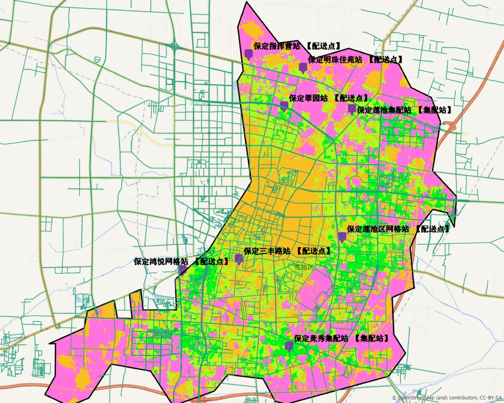
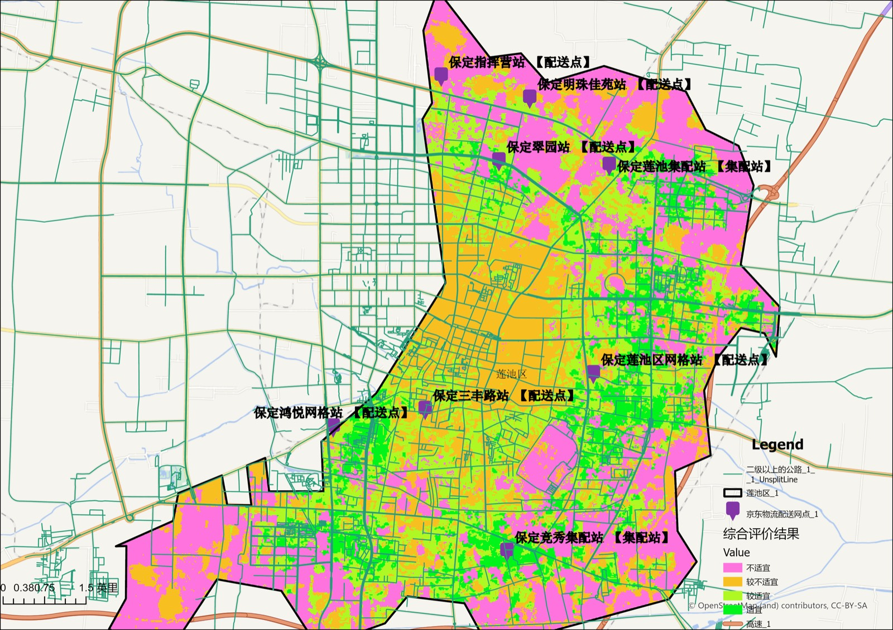

# 保定市莲池区物流选址 ArcGIS Pro 工程

本仓库整理了一个基于 ArcGIS Pro 的物流设施选址分析项目。项目以保定市莲池区为研究区，围绕地形条件、交通可达性、土地利用和现有京东物流网点分布等因子，构建综合评价结果，并进一步自动生成候选选址点、推荐选址点和最佳选址点。

该仓库不是一个纯代码项目，而是一个完整的 GIS 工程归档，包含 ArcGIS Pro 工程文件、地理数据库、布局成果图和自动化选址脚本，适合用于课程设计、GIS 实训、空间分析案例展示和二次扩展开发。

当前仓库已经包含两条自动化路线：

- [`MyProject8/scripts/auto_select_sites.py`](/Users/zhaoruizhe/Desktop/project/T/MyProject8/MyProject8/scripts/auto_select_sites.py)：按规则排序的自动选址流程
- [`MyProject8/scripts/genetic_site_selection.py`](/Users/zhaoruizhe/Desktop/project/T/MyProject8/MyProject8/scripts/genetic_site_selection.py)：基于遗传算法的启发式选址流程
- [`MyProject8/scripts/export_site_selection_artifacts.py`](/Users/zhaoruizhe/Desktop/project/T/MyProject8/MyProject8/scripts/export_site_selection_artifacts.py)：自动导出地图、PDF、结果表和摘要

## 项目概述

- 研究区：保定市莲池区
- 工程软件：ArcGIS Pro
- 核心脚本环境：Windows + ArcGIS Pro 自带 `arcgispro-py3`
- 主要目标：从综合评价栅格中提取高适宜区，并结合道路条件自动生成推荐选址点
- 当前工程数据体量：约 19 MB

从工程内部结构可以确认，本项目已经组织了以下关键数据层：

- 研究区边界：`莲池区_1`
- 候选点图层：`备选点`
- 高速图层：`高速_1`
- 二级及以上公路：`二级以上的公路_1`
- 京东物流配送网点：`京东物流配送网点_1`
- 基础因子栅格：`DEM`、`坡度`、`CLCD_2025`、`公路密度`、`欧氏距离计算高速距离`、`京东物流_核密度`
- 重分类结果：`海拔_重分类`、`坡度_重分类`、`CLCD_2025_重分类`、`公路密度_重分类`、`高速_欧氏距离_重分类`、`京东物流_重分类核密度`
- 综合评价输出：`综合评价结果`

## 自动化脚本做了什么

仓库中的 [`MyProject8/scripts/auto_select_sites.py`](/Users/zhaoruizhe/Desktop/project/T/MyProject8/MyProject8/scripts/auto_select_sites.py) 是本项目最核心的自动化逻辑。脚本运行后会按以下流程执行：

1. 读取 `综合评价结果` 栅格，并根据最大值比例或手动阈值提取高适宜区。
2. 使用研究区 `莲池区_1` 对结果进行裁剪。
3. 将高适宜区栅格转换为面，并删除面积过小的碎片地块。
4. 优先使用已有 `备选点`；如果没有可用点，则自动在候选地块内部生成点。
5. 为候选点提取综合评价值，并分别计算到 `高速_1` 和 `二级以上的公路_1` 的距离。
6. 按综合评价值、候选地块面积和道路距离进行排序。
7. 输出 `推荐选址点`、`最佳选址点` 等结果图层。

脚本默认参数已经和当前工程数据命名对齐，因此只要在正确环境中打开该工程，通常不需要额外改名。

## 目录结构

```text
.
├── README.md
├── .gitignore
├── docs/
│   ├── map-preview.jpg
│   └── layout-preview.jpg
└── MyProject8/
    ├── MyProject8.aprx              # ArcGIS Pro 工程文件
    ├── MyProject8.atbx              # ArcGIS 工具箱
    ├── MyProject8.gdb/              # 工程核心空间数据
    ├── scripts/
    │   ├── auto_select_sites.py     # 规则排序选址脚本
    │   ├── genetic_site_selection.py # 遗传算法选址脚本
    │   ├── export_site_selection_artifacts.py # 导出 PDF/PNG/CSV/摘要
    │   └── pull_and_run_genetic_site_selection.bat # Windows 端同步并执行
    ├── 地图.tif                     # 地图成果导出
    └── 布局2.tif                    # 布局成果导出
```

说明：

- 仓库根目录只是包装层，真正的 ArcGIS Pro 工程内容位于 `MyProject8/` 子目录。
- `MyProject8.gdb/` 中保存了研究区、道路、候选点、评价结果和自动化输出要素。
- 工程中还引用了天地图底图服务，在线浏览底图时需要网络连接。

## 运行方式

### 1. 打开工程

在 Windows 环境中使用 ArcGIS Pro 打开：

- [`MyProject8/MyProject8.aprx`](/Users/zhaoruizhe/Desktop/project/T/MyProject8/MyProject8/MyProject8.aprx)

打开后可以直接查看：

- 地图视图 `地图`
- 布局视图 `布局` / `布局2`
- 带标题栏模板的布局 `标题栏 A4 横向`

### 2. 运行自动选址脚本

请在 ArcGIS Pro 自带 Python 环境中执行。若当前工作目录位于仓库根目录，请使用：

```bash
python MyProject8/scripts/auto_select_sites.py
```

如果先切换到 `MyProject8/` 目录，也可以运行：

```bash
python scripts/auto_select_sites.py
```

如果脚本不在 ArcGIS 工程根目录下运行，可以显式指定项目目录：

```bash
python scripts/auto_select_sites.py --project-dir "D:\\path\\to\\MyProject8"
```

常用参数：

- `--threshold-value`：手动指定高适宜区阈值
- `--threshold-ratio`：按综合评价最大值比例自动取阈值，默认 `0.8`
- `--min-area`：候选地块最小面积，默认 `50000`
- `--top-n`：输出推荐点数量，默认 `5`
- `--no-existing-candidates`：忽略已有 `备选点`，直接自动生成候选点

### 3. 运行遗传算法选址脚本

如果你希望从候选地块中自动搜索一组更优站点，而不是只对已有点排序，可以执行：

```bash
python MyProject8/scripts/genetic_site_selection.py --project-dir MyProject8
```

常用参数：

- `--num-sites`：选择站点数量，默认 `3`
- `--random-points`：自动生成的随机候选点数量，默认 `80`
- `--population-size`：遗传算法种群规模，默认 `60`
- `--generations`：遗传算法迭代代数，默认 `80`
- `--mutation-rate`：变异概率，默认 `0.18`
- `--min-site-distance`：站点最小间距约束，默认 `1200`
- `--weight-suitability`：综合评价值权重
- `--weight-area`：候选地块面积权重
- `--weight-expressway`：到高速距离权重
- `--weight-major-road`：到二级以上公路距离权重

脚本会在 geodatabase 中输出：

- `候选地块_GA`
- `候选点_GA_池`
- `候选点_GA_评价`
- `遗传算法推荐选址点`
- `遗传算法最佳选址点`

如果你在 Windows 上已经把仓库克隆到 `D:\project\baoding-lianchi-logistics-site-selection`，还可以直接运行：

```bat
MyProject8\scripts\pull_and_run_genetic_site_selection.bat
```

这个批处理会自动：

- 在 `D:\project\baoding-lianchi-logistics-site-selection` 执行 `git pull --ff-only`
- 用 `robocopy` 把仓库镜像到 `D:\project\baoding-lianchi-logistics-site-selection-runtime`
- 在 runtime 副本里调用 ArcGIS Pro 自带的 `propy.bat`
- 导出 `CSV / PDF / PNG / Markdown` 成果文件
- 把导出结果同步回源仓库的 `artifacts/latest`
- 自动提交并推送到 GitHub

这样可以避免 ArcGIS 在运行时直接改脏 Git 仓库里的 `.gdb` 文件，后续继续 `pull` 新代码时会稳定很多。

导出的成果默认位于：

- Windows runtime：`D:\project\baoding-lianchi-logistics-site-selection-runtime\artifacts\latest`
- Git 仓库同步目录：`artifacts/latest`

同步后的主要文件包括：

- `artifacts/latest/recommended_sites.csv`
- `artifacts/latest/best_site.csv`
- `artifacts/latest/summary.md`
- `artifacts/latest/*.pdf`
- `artifacts/latest/*.png`

## 分析思路

从当前工程组织方式可以看出，本项目采用的是较典型的多因子综合评价 + 候选点筛选路线：

- 第一步：准备海拔、坡度、土地利用、道路密度、高速可达性、现有网点密度等评价因子。
- 第二步：对各因子进行重分类，使不同来源的数据具备统一评价尺度。
- 第三步：叠加生成 `综合评价结果` 栅格，识别高适宜区。
- 第四步：将高适宜区转为候选面，剔除面积过小的零散斑块。
- 第五步：结合已有候选点或自动生成点，进一步基于道路距离和评价值输出最终推荐位置。

其中遗传算法版本在规则排序之外又加了一层启发式搜索：

- 先把已有备选点、候选地块质心和随机候选点合并成候选点池。
- 再按综合评价值、地块面积、到高速距离、到主干路距离构造单点得分。
- 最后用遗传算法搜索满足最小站点间距约束的最优站点组合。

这种做法更适合你要的“纯 Python 自动化选址”，因为它可以直接命令行运行，也方便后续继续调参数和批量实验。

## 当前工程成果

仓库中保留了两张已经导出的成果图：

- [`MyProject8/地图.tif`](/Users/zhaoruizhe/Desktop/project/T/MyProject8/MyProject8/地图.tif)
- [`MyProject8/布局2.tif`](/Users/zhaoruizhe/Desktop/project/T/MyProject8/MyProject8/布局2.tif)

另外，仓库提供了适合 GitHub 在线预览的压缩图：




## 适用场景

- GIS 空间分析课程设计
- 物流设施选址案例展示
- ArcGIS Pro 工程打包归档
- `arcpy` 自动化处理脚本示例
- 多因子综合评价流程演示

## 注意事项

- 脚本依赖 `arcpy` 和 Spatial Analyst 扩展，普通 Python 环境无法直接运行。
- 本仓库可以公开展示工程结构和成果，但若后续接入真实生产数据，建议重新评估数据授权和隐私边界。
- `MyProject8.atbx` 当前基本为空工具箱，主要起到 ArcGIS Pro 工程默认工具箱占位作用。

## 后续可扩展方向

- 将因子权重显式参数化，便于比较不同选址策略。
- 增加结果表导出，自动生成候选点评分明细。
- 将脚本封装为 ArcGIS 自定义工具箱工具，减少命令行使用门槛。
- 为布局图增加更明确的专题标题、图源说明和结果解释文字。
